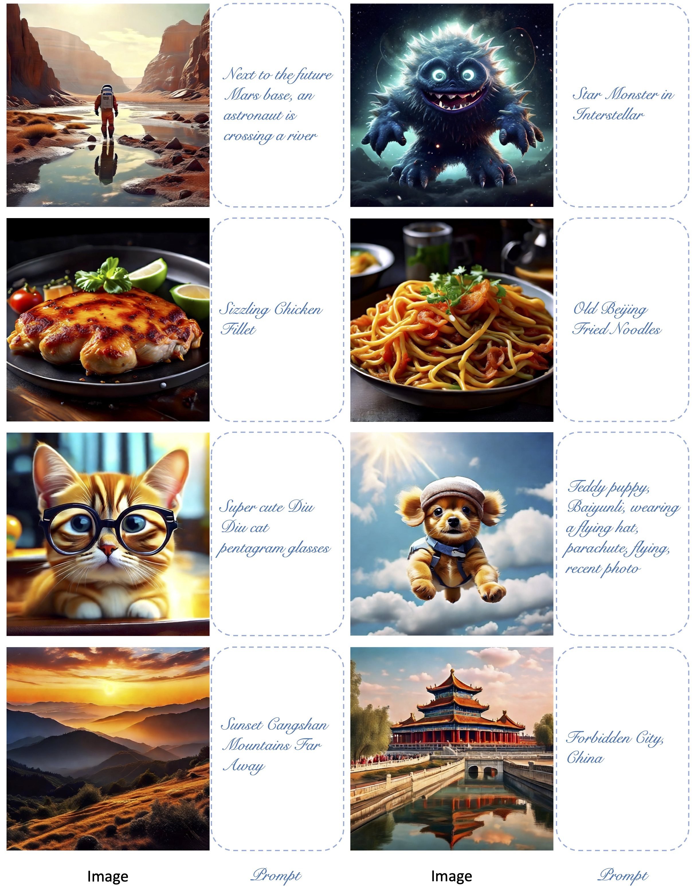

## CCM: Adding Conditional Controls to Text-to-Image Consistency Models
This is the implementation of the paper "CCM: Adding Conditional Controls to Text-to-Image Consistency Models".

For more information, check out the paper on [[arXiv](https://arxiv.org/pdf/2312.06971.pdf)].
                                                      
## Training                  
Coming soon!
                                                      
## Inference      
Coming soon!
                                                      
## Main Results
#### 1. CM

    

                                                      
#### 2. CCM

    

